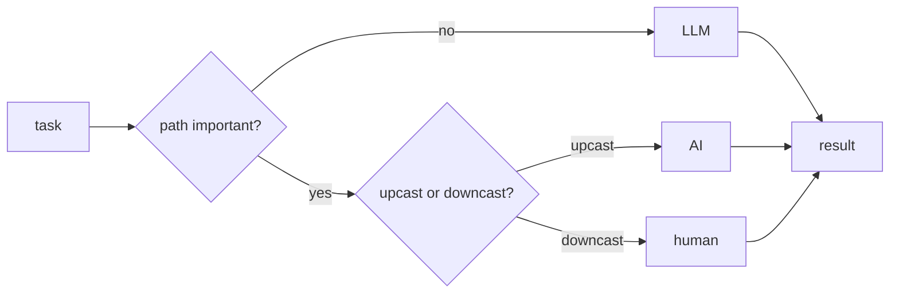

# Filippo De Simoni

a glimpse into my Mathematics & Computer Science

[deshi.ch](https://deshi.ch) · [LinkedIn](https://www.linkedin.com/in/mrdeshi/)

## About

I'm Filippo De Simoni, I am passionate about Mathematics and Computer Science, in particular Algorithms: from linear algebra in computer graphics to discrete math, optimization, and operations research.

BSc student in [Computer Science Engineering](https://www.supsi.ch/en/bachelor-computer-science-engineering) at SUPSI, Lugano.

`Algorithms` `Optimization` `Computer Graphics` `Machine Learning` `Discrete Math` `Systems Programming`

## How I use AI

AI should be used for mechanical things like formatting, boilerplate, and verification. Intellectual and creative work stays with the human.

> The most difficult part is downcasting: you create information. When you upcast it is mechanical.

When you learn coding you can take an existing idea and reproduce it, for example Pac-Man. When you create, you write all the downcasts needed and the creation can be delegated to an LLM, for example my parallelizer.

The distilled question: is the path important or just the product?

Semantic work is a downcast, a composition, so I write it by hand. My thesis paper, for example, is written by hand.

## Projects

| project | year | |
| --- | --- | --- |
| Software Representations & Optimization | 2026 | Bachelor Thesis, High Performance Computing. Automatic parallelization of C programs. Speedups comparable with ad hoc parallelization, outputs verified bit-identical. |
| Machine Scheduling: Configuration LP | 2025 - 2026 | Semester Project. Approximation algorithms for machine scheduling, with a PhD candidate and a postdoc. |
| Higgs Boson Signal Detection | | An end-to-end machine learning pipeline for Higgs boson signal detection. |
| 3D Graphics Engine | | A 3D graphics engine in C++, used to build a playable 3D Tower of Hanoi game. |
| Graph Dynamic Programming | | Optimization on graph structures and complexity analysis. |
| C Threads Library | | A threads library in pure C, with creation, synchronization and scheduling. |
| 4 points on Sphere | | Formal proof that the probability of a sphere's center lying inside a tetrahedron formed by 4 random surface points is 1/8. |
| Start-Up Outzone | 2023 - now | Co-Founder & Backend Developer. Backend development for the [Outzone](https://outzone.app/) start-up. |
| Smart Regression | | |
| Arch linux Rice | | |
| Recurrence Integration method | | |
| Collatz Conjecture | | |
| Tree Access Optimization | | |
| Digital Scriptorium | | |
| NLP school project | | |
| Pac-Man | | |
| Arkanoid | | |
| Fibonacci Sphere | | The 3D word cloud on [deshi.ch](https://deshi.ch). |

## Experience

- **2023 - now** · Co-Founder & Backend Developer · Outzone, Lugano
- **2024 - now** · Peer Tutor (Formal Collaborator) · SUPSI, Lugano

## Education

- **2022 - now** · BSc Computer Science Engineering · SUPSI, Lugano · GPA 5.25 / 6.0, 168 ECTS
- **2017 - 2022** · Scientific High School Diploma · Liceo Scientifico A. Pacinotti, La Spezia · Final grade 100/100
- Introduction to Metric Spaces · MIT OpenCourseWare, online · Self-directed study of topology and real analysis
